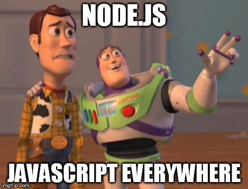

# [Node.js - javascript everywhere](http://slides.com/vitorfernandes/nodejs-everywhere#/)

## Summary
Get an overview of what Node.js is and how you can use it.

We will go over the Node.js architecture, the development eco-system and a brief live-coding session on how to write and test your apps.

- the motive behind node.js
- node architecture
- the event loop
- npm & CommonJS modules
- LIVE CODING: a simple API server
- unit testing

Organized by [MainHub - Innovation, Incubation & Development](https://www.facebook.com/MainHub/)